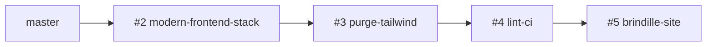

# Plan — Interface CJD (fork paheko_cjd)

**Dernière mise à jour :** 16 mai 2026  
**Branche principale :** `master` (fusion complète le 16 mai 2026)

## Objectif

Interface **Paheko CJD fixe** : vert `#00D556`, Open Sans / Saira Condensed, sans thèmes interchangeables ni personnalisation des couleurs admin. Stack moderne : **Vite 6**, **Tailwind v4** (thème uniquement côté admin), CSS métier en composants.

---

## Où on en est (synthèse)

| Zone | État | Détail |
|------|------|--------|
| **Admin — stack** | ✅ Fait | Vite, `static/dist/admin.css`, `_head.tpl` + shell CJD |
| **Admin — templates** | ✅ Fait | ~124+ écrans avec classes `cjd-*` |
| **Admin — CSS legacy** | ✅ Fait | 100 % `frontend/src/admin/components/` (plus d’import legacy au build) |
| **Admin — bundle** | ✅ Fait | ~62 Ko minifié (gzip ~13 Ko), utilities Tailwind retirées |
| **CI / qualité** | ✅ Fait | GitHub Actions, PHPStan, ESLint, Stylelint, `make ci` |
| **Site public Brindille** | ✅ Fait | `default.css`, `content.css`, `print.css`, tokens partagés |
| **Fusion `master`** | ✅ Fait | Poussé sur `origin/master` |
| **Préprod / prod** | ⏳ À faire | Déploiement + smoke test |
| **Tests manuels complets** | ⏳ À faire | Voir checklist ci-dessous |

---

## Pile de pull requests (ordre de fusion)



| PR | Branche | Contenu principal |
|----|---------|-------------------|
| [#2](https://github.com/Emilien-Etadam/paheko_cjd/pull/2) | `cursor/modern-frontend-stack-958a` | Interface admin CJD, migration templates, composants CSS |
| [#3](https://github.com/Emilien-Etadam/paheko_cjd/pull/3) | `cursor/purge-tailwind-958a` | Retrait utilitaires Tailwind parasites (−2,4 Ko) |
| [#4](https://github.com/Emilien-Etadam/paheko_cjd/pull/4) | `cursor/add-lint-ci-958a` | CI GitHub, PHPStan, ESLint, Stylelint |
| [#5](https://github.com/Emilien-Etadam/paheko_cjd/pull/5) | `cursor/brindille-cjd-site-958a` | Site public Brindille (layout + print + tokens partagés) |

**Statut :** les branches `cursor/*` ont été intégrées dans `master` par fast-forward. Les PR #2–#5 peuvent être fermées.

---

## Architecture des assets

### Administration

```
frontend/src/admin/
  admin.css          → tailwindcss/theme + tokens + components
  tokens.css         → @import shared + @theme + legacy Paheko
  components/        → shell, forms, tables, compta, etc.
src/www/admin/static/dist/
  admin.css          → bundle produit (~62 Ko)
  handheld.css, print.css, tables-export.css
```

### Site public (Brindille)

```
frontend/src/shared/cjd-tokens.css   ← source unique couleurs / typos
frontend/src/brindille/
  default.css        → import layout/* (16 partials)
  content.css        → contenu éditorial + CJD
  print.css
build/cjd-web/       → artefacts versionnés
  _head.html, default.css, content.css, print.css
```

`src/modules/` est **gitignoré** (zip Paheko). Après `make modules` :

```bash
make install-cjd-web   # copie build/cjd-web/* → src/modules/web/
```

### Bundles actuels (minifiés)

| Fichier | Taille approx. | gzip |
|---------|----------------|------|
| Admin `dist/admin.css` | 62 Ko | ~13 Ko |
| Brindille `default.css` | 17 Ko | ~4,8 Ko |
| Brindille `content.css` | 13 Ko | ~4,2 Ko |
| Brindille `print.css` | 1 Ko | ~0,5 Ko |

---

## Phases réalisées (historique)

1. **Stack frontend** — Vite, Tailwind v4, structure `frontend/`
2. **Charte CJD admin** — tokens, shell, header, sans thèmes
3. **Migration écrans** — accueil, membres, compta, config, web, mailing…
4. **Allègement legacy** — phases 1 à 5, éclatement forms, 100 % components
5. **Correction régression** — `dist/admin.css` (commit critique)
6. **Purge Tailwind** — plus de scan `.hidden` / `.flex` dans les `.tpl`
7. **CI + lint** — PHPStan baseline, ESLint, Stylelint
8. **Brindille** — thème public, migration `default.css`, tokens partagés, `print.css`

---

## Prochaines étapes

### Priorité haute (mise en production)

- [ ] Vérifier **checks CI** verts sur les 4 PR
- [ ] **Smoke test admin** : login, membres, compta, modales `#dialog`, mobile &lt; 981px, export CSV
- [ ] **Smoke test site public** : accueil, article, catégories, contact, impression
- [ ] Fusionner vers **`master`** et déployer en préproduction
- [ ] `composer install` + `cd frontend && npm ci && npm run build` + `make install-cjd-web` sur le serveur

### Priorité moyenne (qualité)

- [ ] Réduire la **baseline PHPStan** (23 erreurs figées)
- [ ] Durcir progressivement **Stylelint** sur `brindille/layout/`
- [ ] Documenter le flux de déploiement dans le README du fork (optionnel)

### Priorité basse (nettoyage)

- [ ] Supprimer `frontend/src/admin/legacy/` (archives non importées : `01-layout`, `05-navigation`)
- [ ] Personnaliser footer Brindille (« Propulsé par Paheko »)
- [ ] Squelettes Brindille additionnels (`_foot.html`, `contact.html`) si besoin CJD
- [ ] Supprimer `.travis.yml` obsolète (remplacé par GitHub Actions)

---

## Commandes de référence

```bash
# Setup complet
composer install
cd frontend && npm ci && npm run build
cd src && make deps && make modules
make install-cjd-web

# Qualité
make ci                    # deps, tests, phpstan, lint, build, install-cjd-web

# Dev local
cd src && make dev-server  # http://localhost:8082
```

---

## Risques / points d’attention

- **`make modules`** écrase `src/modules/web/` → toujours relancer **`make install-cjd-web`** après.
- **Cache site Paheko** : vider le cache web après déploiement CSS.
- **Éditeur de pages** : `content.css` doit rester aligné admin / public (même bundle).
- **Pas de couleurs configurables** : `customColors()` désactivé côté PHP — comportement voulu CJD.
